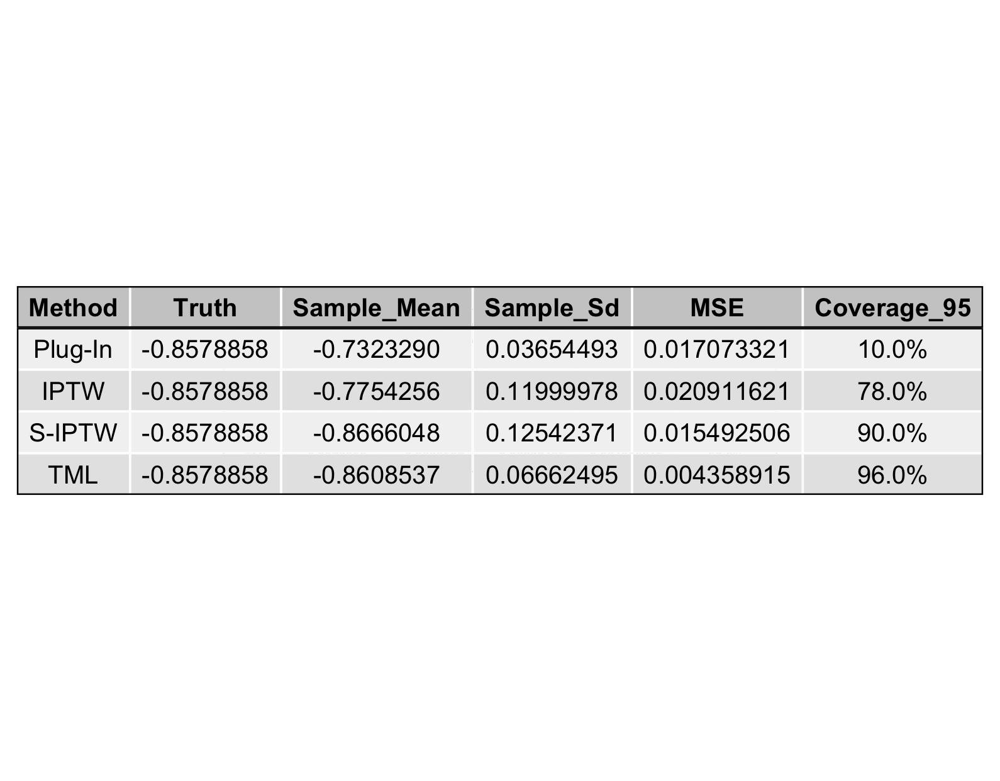
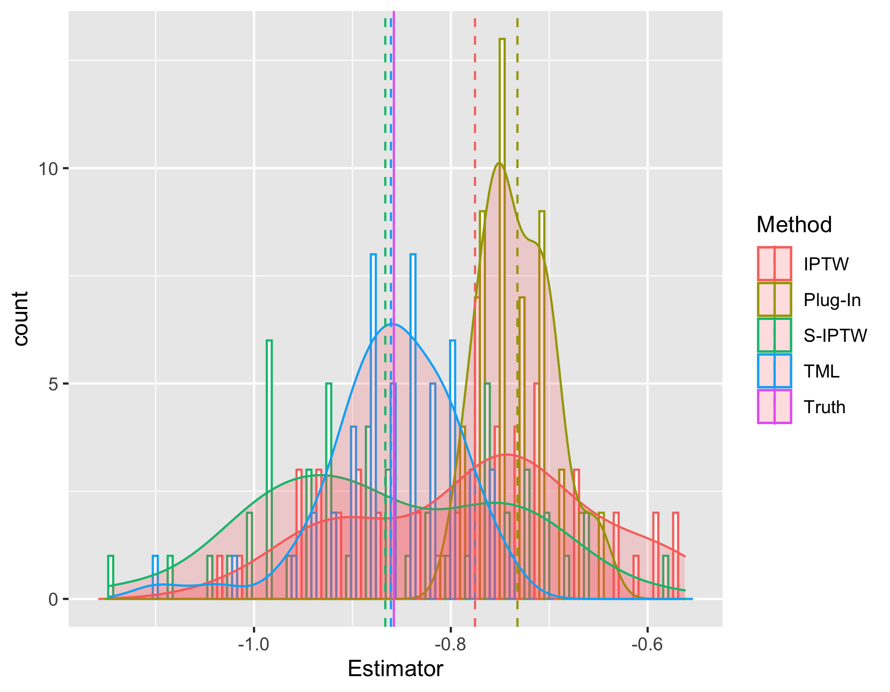
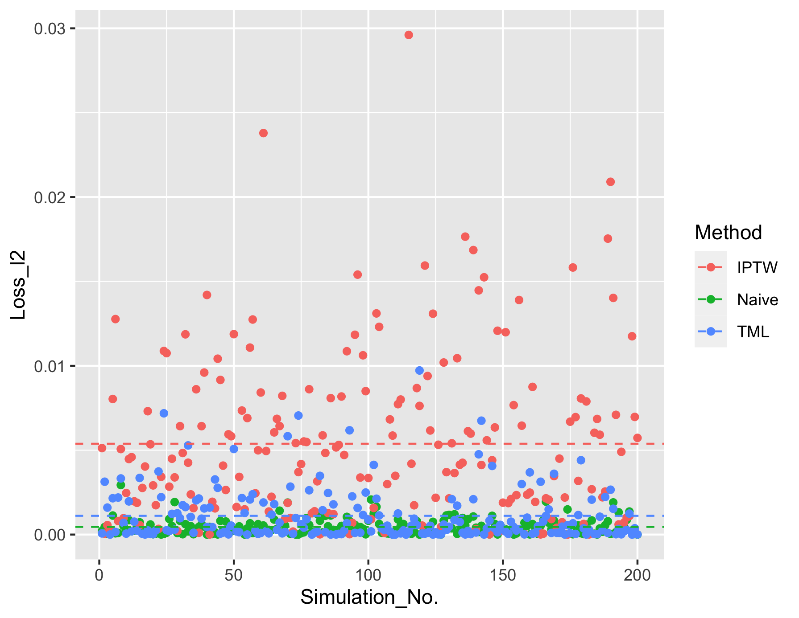

```{r setup, include=FALSE}
knitr::opts_chunk$set(echo = TRUE)
```

## Package

An extension package `tmle3trans` based on the `tmle3` package of the `tlverse` ecosystem was developed to provide double robust TMLE for site transportation. Install the package via:
```{r pkg, eval=FALSE}
devtools::install_github("Zyx0Wu/tmle3trans")
```
```{r lib, eval=TRUE}
library(tmle3trans)
```
## Simulation setup

We generate a sequence of `n` data based on our factorization. For the sake of demonstrating effectiveness, robustness and efficiency, we only preserve the essence and `A` is not included. The data model for `W` is fixed, the ones for `S` and `Y` vary through the sections depending on the specific goals. Truth for site `S=0` is approximated by the mean outcome on that site with an excessively high `n`.
```{r, echo=TRUE, eval=FALSE}
W1 <- sample(1:4, n, replace=TRUE, prob=c(0.1, 0.2, 0.65, 0.05))
W2 <- rnorm(n, 0.7, 1)
W3 <- rpois(n, 3)
```

## TMLE Double Robustness

### Setup
To demonstrate the double robustness property, we set the true model as:
```{r, echo=TRUE, eval=FALSE}
S <- rbinom(n, 1, expit(1.4 - 0.6 * W1 - 2 * W2 + 0.7 * W3))
Y <- rnorm(n, -1 - .5 * W1 + .8 * W2 + .2 * W3, .4)
```
And give an error on the level of `n^(-0.4)` to both of the fitted models:
```{r, echo=TRUE, eval=FALSE}
S_hat <- expit(1.4 - 0.6 * W1 - 2 * W2 + 0.7 * W3 + n^(-0.4))
Y_hat <- -1 - .5 * W1 + .8 * W2 + .2 * W3 + n^(-0.4))
```
The two benchmark estimators are:
#### Naive (Plug-in)
```{r, echo=TRUE, eval=FALSE}
naive_psi <- mean(Y_hat[S==0])
naive_se <- sd(Y_hat[S==0])/sqrt(length(Y_hat[S==0]))
```
#### IPTW
```{r, echo=TRUE, eval=FALSE}
iptw_psi <- mean(S==1/S_hat*(1-S_hat)/mean(S==0) * Y)
iptw_se <- sd(S==1/S_hat*(1-S_hat)/mean(S==0) * Y)/sqrt(n)
```
The TMLE in this case require using likelihhod factor 
`LF_known` to feed in pre-fitted distributions.
The workflow is as follow:
##### wrap up fitted model
```{r, echo=TRUE, eval=FALSE}
s_dens <- function(w, bias=FALSE) expit(1.4 - 0.6 * w[1] - 2 * w[2] + 0.7 * w[3] + bias * n^(-0.4))
y_dens <- function(w, bias=FALSE) -1 - .5 * w[1] + .8 * w[2] + .2 * w[3] + bias * n^(-0.4)

g_dens <- function(task) apply(task$get_node("covariates"), 1, s_dens, bias=TRUE)
Q_mean <- function(task) apply(task$get_node("covariates"), 1, y_dens, bias=TRUE)
```
##### set up task
```{r, echo=TRUE, eval=FALSE}
tmle_spec <- tmle_AOT(1, 0)
tmle_task <- tmle_spec$make_tmle_task(data, node_list)
factor_list <- list(
  define_lf(LF_emp, "W"),
  define_lf(LF_known, "S", density_fun = g_dens),
  define_lf(LF_known, "Y", mean_fun = Q_mean, type = "mean")
)
```
##### get initial likelihhod
```{r, echo=TRUE, eval=FALSE}
initial_likelihood <- Likelihood$new(factor_list)$train(tmle_task)
```
##### update initial likelihood
```{r, echo=TRUE, eval=FALSE}
updater <- tmle3_Update$new(maxit = 10)
targeted_likelihood <- Targeted_Likelihood$new(initial_likelihood, updater)
tmle_param <- tmle_spec$make_params(tmle_task, targeted_likelihood)
tmle_fit <- fit_tmle3(tmle_task, targeted_likelihood, tmle_param, updater)

tmle_psi <- tmle_summary$tmle_est
tmle_se <- tmle_summary$se
```

### Result

#### Truth
```{r, echo=FALSE, eval=TRUE}
set.seed(1234)
n <- 1e5
W1 <- sample(1:4, n, replace=TRUE, prob=c(0.1, 0.2, 0.65, 0.05))
W2 <- rnorm(n, 0.7, 1)
W3 <- rpois(n, 3)
S <- rbinom(n, 1, expit(1.4 - 0.6 * W1 - 2 * W2 + 0.7 * W3))
Y <- rnorm(n, -1 - .5 * W1 + .8 * W2 + .2 * W3, .4)

YS0 <- Y[S==0]
mean <- mean(YS0)
#sd <- sd(YS0) / sqrt(length(YS0))
ics <- (S==1)/(expit(1.4 - 0.6 * W1 - 2 * W2 + 0.7 * W3))*(1-expit(1.4 - 0.6 * W1 - 2 * W2 + 0.7 * W3))/mean(S==0) * (Y - (-1 - .5 * W1 + .8 * W2 + .2 * W3)) + (S==0)/mean(S==0) * ((-1 - .5 * W1 + .8 * W2 + .2 * W3) - mean)
ic <- sd(ics) / sqrt(n)
```
```{r, echo=TRUE, eval=TRUE}
mean
ic
```

#### Summary


#### Estimators


#### Loss



#### Efficiency
```{r, echo=TRUE, eval=FALSE}
mean(tmle_ses) * sqrt(obs) / sd(D)
```
```{r, echo=FALSE, eval=TRUE}
0.9493497
```

## SL effectiveness

### Setup
We set up a logistics model for `S` and a complicated model for `Y`, then use the 
initial estimator to demonstrate the power of super learner as opposed to the naive method:
```{r, echo=TRUE, eval=FALSE}
S <- rbinom(n, 1, expit(1.4 - 0.6 * W1 - 2 * W2 + 0.7 * W3))
Y <- rnorm(n, -1 + .5 * W1 * sin(W3 + 8) + .2 * sqrt(abs(-W2^3 + exp(W2/(W3-3.5)))), .4)
```
We use a library of mean, glm and xgboost algorithms with logistic metalearner 
to learn the outcome model. The workflow for setting up learners is as follow:
```{r, echo=TRUE, eval=FALSE}
qlib <- make_learner_stack(
  "Lrnr_mean",
  "Lrnr_glm_fast"
)

glib <- make_learner_stack(
  "Lrnr_mean",
  "Lrnr_glm_fast",
  "Lrnr_xgboost"
)

ls_metalearner <- make_learner(Lrnr_nnls)
bn_metalearner <- make_learner(
  Lrnr_solnp, metalearner_logistic_binomial,
  loss_loglik_binomial
)
Q_learner <- make_learner(Lrnr_sl, qlib, ls_metalearner)
g_learner <- make_learner(Lrnr_sl, glib, bn_metalearner)
learner_list <- list(Y = Q_learner, S = g_learner)
```
The initial likelihood can thus be fitted by:
```{r, echo=TRUE, eval=FALSE}
initial_likelihood <- tmle_spec$make_initial_likelihood(tmle_task, learner_list)
```

### Result

#### Truth
```{r, echo=FALSE, eval=TRUE}
set.seed(1234)
n <- 1e5
W1 <- sample(1:4, n, replace=TRUE, prob=c(0.1, 0.2, 0.65, 0.05))
W2 <- rnorm(n, 0.7, 1)
W3 <- rpois(n, 3)
S <- rbinom(n, 1, expit(1.4 - 0.6 * W1 - 2 * W2 + 0.7 * W3))
Y <- rnorm(n, -1 + .5 * W1 * sin(W3 + 8) + .2 * sqrt(abs(-W2^3 + exp(W2/(W3-3.5)))), .4)

YS0 <- Y[S==0]
mean <- mean(YS0)
#sd <- sd(YS0) / sqrt(length(YS0))
```
```{r, echo=TRUE, eval=TRUE}
mean
```

#### Summary


#### Estimators


#### Loss


